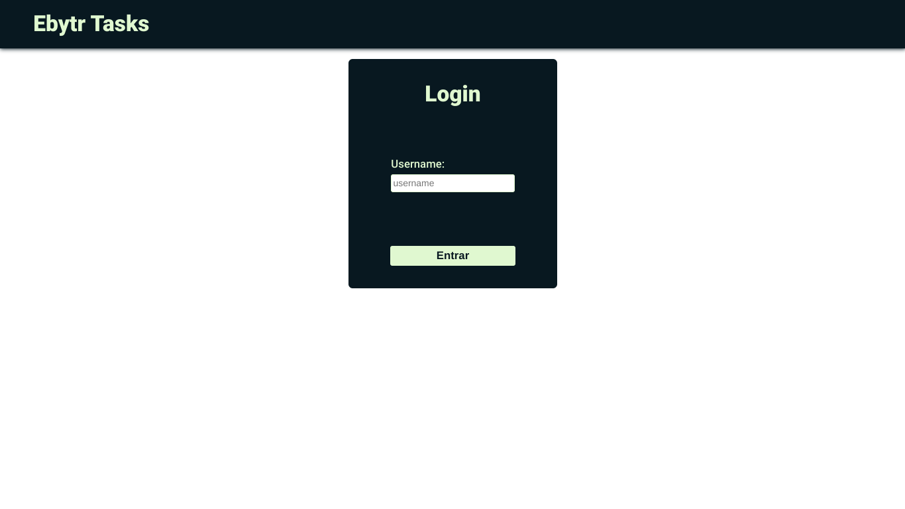
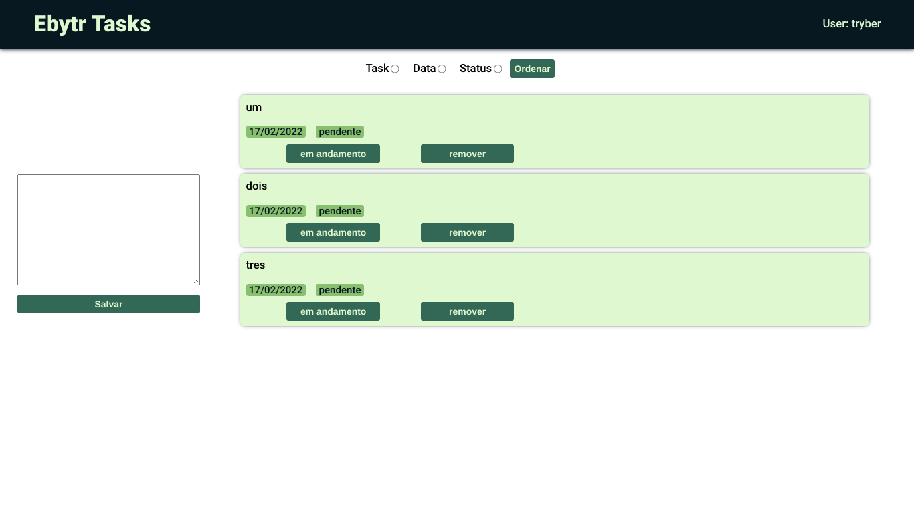
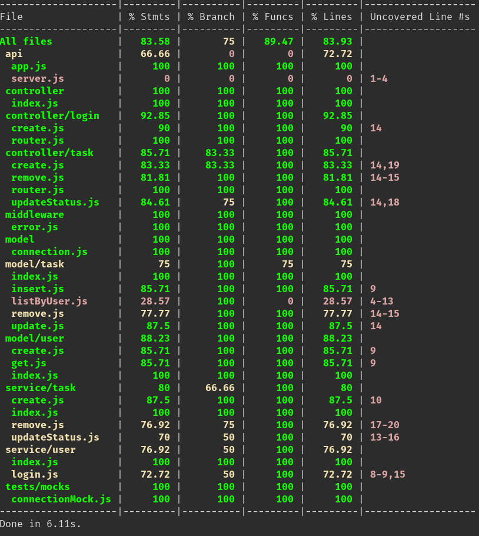

# Ebytr Tasks

Projeto desenvolvido como desafio de processo seletivo da Ebytr

É uma aplicação para organização de tarefas, que conta com o front-end em React e back-end em node com express e banco de dados MongoDB

## Funcionalidades

- Login por username
- Criar uma tarefa
- Mudar o status das tarefas para _em andamento_ e _feito_
- Deletar tarefas
- Mudar a ordenação da lista de tarefas por:
  - Tarefa em ordem alfabética
  - Data de criação
  - Status


## Stack utilizada

**Front-end:** React, ContextAPI

**Back-end:** Node, Express

**Database:** MongoDB
## Rodando localmente

**Pre-requisitos:** MongoDB, node, npm

Clone o projeto

```bash
  git clone https://github.com/leo606/ebytr-challenge-trybe
```

Entre no diretório do projeto

```bash
  cd ebytr-challenge-trybe
```

### Instale as dependências de front-end:

Do diretório raiz do projeto, entre do diretório `front-end`
```bash
  cd front-end
```

Instale as dependências

```bash
  npm install
```

### Instale as dependências de back-end:

Do diretório raiz do projeto, entre do diretório `front-end`
```bash
  cd back-end
```

Instale as dependências

```bash
  npm install
```

### Inicie o servidor back-end:

Do diretório raiz do projeto inicie o servidor com
```bash
  node back-end/
```

### Inicie o servidor front-end:

Do diretório raiz do projeto entre do diretório `front-end`

```bash
  cd front-end
```

Inicie o servidor `front-end`

```bash
  cd front-end
```
## Screenshots





## 🔗 Entre em contato
[](http://leo606.github.io/)
[](https://www.linkedin.com/in/leonardolmf/)